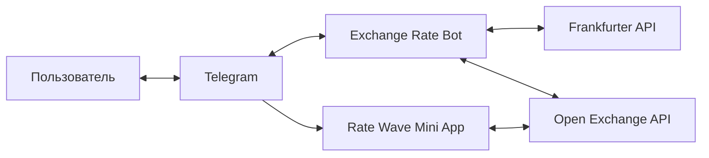

# Exchange Rate Platform

Telegram-бот и Mini App для проверки курса валюты относительно USD. Бот
обрабатывает текстовые сообщения, а **Rate Wave Mini App** даёт пользователю
интерактивный интерфейс внутри Telegram.



## Возможности

- извлечение трёхбуквенного кода валюты из сообщения;
- получение курса к USD;
- fallback: Frankfurter API → Open Exchange API;
- отправка результата через Telegram Bot API;
- Svelte Mini App с Telegram-темой, ручным вводом кода и SVG-анимацией волны.

## Структура

```text
.
├── src/                    # Backend: Clean Architecture
│   ├── domain/             # Чистая предметная логика
│   ├── application/        # Use cases и порты
│   ├── presentation/       # Fastify и Telegram webhook-контроллер
│   ├── infrastructure/     # Telegram и курсовые API-адаптеры
│   └── main/               # Composition root и запуск
├── mini-app/               # Независимое Svelte/Vite приложение
├── test/                   # Тесты backend
└── docs/                   # C4 и архитектурная документация
```

## Backend

Требуется Node.js 20+ и pnpm.

```bash
pnpm install
```

Создайте `.env` в корне проекта:

```env
TELEGRAM_TOKEN=ваш_токен_бота
PORT=3000
```

Запуск и тесты:

```bash
pnpm start
pnpm test
```

Webhook ожидает Telegram updates по адресу `POST /webhook`.

## Mini App

Mini App — отдельный пакет, поэтому его зависимости и команды находятся в
папке `mini-app`:

```bash
cd mini-app
pnpm install
pnpm dev
pnpm build
```

Для production создайте второй Vercel-проект из этого же репозитория с
**Root Directory** `mini-app`. После деплоя укажите его HTTPS-адрес в
`@BotFather` через `/setmenubutton`.

Backend и Mini App развёртываются независимо: backend использует корневой
`vercel.json`, а Mini App собирается Vite как статический сайт.

## C4-диаграммы

- [System Context — Level 1](docs/c4-context.puml)
- [Containers — Level 2](docs/c4-container.puml)
- [Backend Components — Level 3](docs/c4-component.puml)
- [Mini App Components — Level 3](docs/c4-mini-app-component.puml)

Диаграммы написаны на чистом PlantUML. Mermaid-схема выше рендерится прямо в
GitHub и даёт быстрый обзор взаимодействий.
