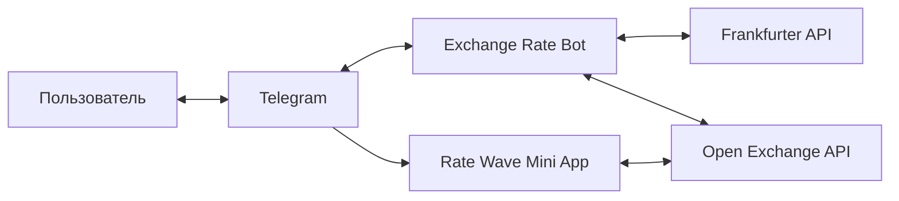

# Exchange Rate Platform

Telegram-бот и Mini App для проверки курса валюты относительно USD. Бот
обрабатывает текстовые сообщения, а **Rate Wave Mini App** даёт пользователю
интерактивный интерфейс внутри Telegram.


```mermaid
flowchart LR
  U[Пользователь] <--> T[Telegram]
  T <--> B[Exchange Rate Bot]
  T --> M[Rate Wave Mini App]
  B <--> F[Frankfurter API]
  B <--> O[Open Exchange API]
  M <--> O
```

## Возможности

- извлечение трёхбуквенного кода валюты из сообщения;
- получение курса к USD;
- fallback: Frankfurter API → Open Exchange API;
- отправка результата через Telegram Bot API;
- Svelte Mini App с Telegram-темой, ручным вводом кода и SVG-анимацией волны.

## Структура

```text
.
├── src/                    # Backend: Clean Architecture
│   ├── domain/             # Чистая предметная логика
│   ├── application/        # Use cases и порты
│   ├── presentation/       # Fastify и Telegram webhook-контроллер
│   ├── infrastructure/     # Telegram и курсовые API-адаптеры
│   └── main/               # Composition root и запуск
├── mini-app/               # Независимое Svelte/Vite приложение
├── test/                   # Тесты backend
└── docs/                   # C4 и архитектурная документация
```

## Backend

Требуется Node.js 20+ и pnpm.

```bash
pnpm install
```

Создайте `.env` в корне проекта:

```env
TELEGRAM_TOKEN=ваш_токен_бота
PORT=3000
```

Запуск и тесты:

```bash
pnpm start
pnpm test
```

Локальный Fastify webhook ожидает Telegram updates по адресу `POST /webhook`.

## Supabase webhook (production)

Production webhook работает как Supabase Edge Function, а Mini App можно
оставить на Vercel. В Supabase задайте secrets `TELEGRAM_TOKEN` и
`TELEGRAM_WEBHOOK_SECRET`, затем разверните функцию и укажите Telegram её URL:

```bash
supabase functions deploy telegram-webhook --use-api
pnpm webhook:prod
```

В `.env` для второй команды укажите `PRODUCTION_URL` как URL Supabase-проекта,
`TELEGRAM_WEBHOOK_PATH=/functions/v1/telegram-webhook` и такой же
`TELEGRAM_WEBHOOK_SECRET`. Функция принимает только `POST` и проверяет заголовок
`X-Telegram-Bot-Api-Secret-Token`, который Telegram добавляет после установки
webhook.

Функция — только входной HTTP-адаптер: она собирает существующие
`ExchangeRateUseCase`, `FrankfurterAdapter`, `OpenExchangeAdapter` и
`TelegramAdapter` из `src`. Поэтому для импорта модулей за пределами
`supabase/` используется API-deploy (`--use-api`).

## Mini App

Mini App — отдельный пакет, поэтому его зависимости и команды находятся в
папке `mini-app`:

```bash
cd mini-app
pnpm install
pnpm dev
pnpm build
```

Для production создайте второй Vercel-проект из этого же репозитория с
**Root Directory** `mini-app`. После деплоя укажите его HTTPS-адрес в
`@BotFather` через `/setmenubutton`.

Backend и Mini App развёртываются независимо: backend использует корневой
`vercel.json`, а Mini App собирается Vite как статический сайт.

## Локальная разработка через LocalTunnel

Сначала установите зависимости в корне и в `mini-app`. Затем откройте три
терминала и выполните команды по порядку:

```bash
# 1. Fastify на http://localhost:3000
pnpm dev:backend

# 2. Svelte/Vite на http://localhost:5173
pnpm dev:frontend

# 3. Публичный HTTPS-туннель к Vite и установка Telegram webhook
pnpm tunnel
```

Один туннель ведёт на Vite. Запросы к `/api` и `/webhook` Vite автоматически
проксирует в Fastify на порту `3000`. Тот же корневой HTTPS-адрес туннеля можно
указать в `@BotFather` через `/setmenubutton` как URL Mini App.

LocalTunnel получает публичный URL и автоматически устанавливает Telegram
webhook на `<URL>/webhook`. При остановке через `Ctrl+C` скрипт сначала возвращает
webhook на адрес `PRODUCTION_URL` из `.env`, а затем закрывает туннель. Если процесс
завершился аварийно, восстановите production webhook вручную:

```bash
pnpm webhook:prod
```

После перезапуска адрес LocalTunnel может измениться, поэтому при необходимости
обновите URL кнопки Mini App в `@BotFather`.

## C4-диаграммы

- [System Context — Level 1](docs/c4-context.puml)
- [Containers — Level 2](docs/c4-container.puml)
- [Backend Components — Level 3](docs/c4-component.puml)
- [Mini App Components — Level 3](docs/c4-mini-app-component.puml)

Диаграммы написаны на чистом PlantUML. Mermaid-схема выше рендерится прямо в
GitHub и даёт быстрый обзор взаимодействий.
